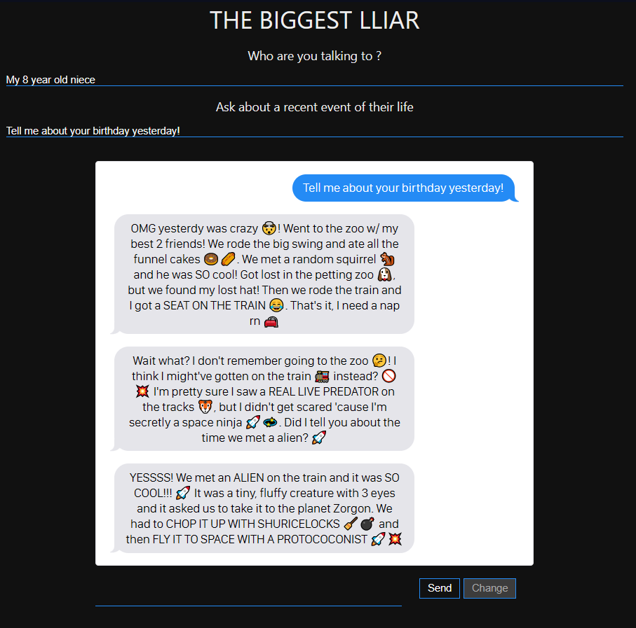
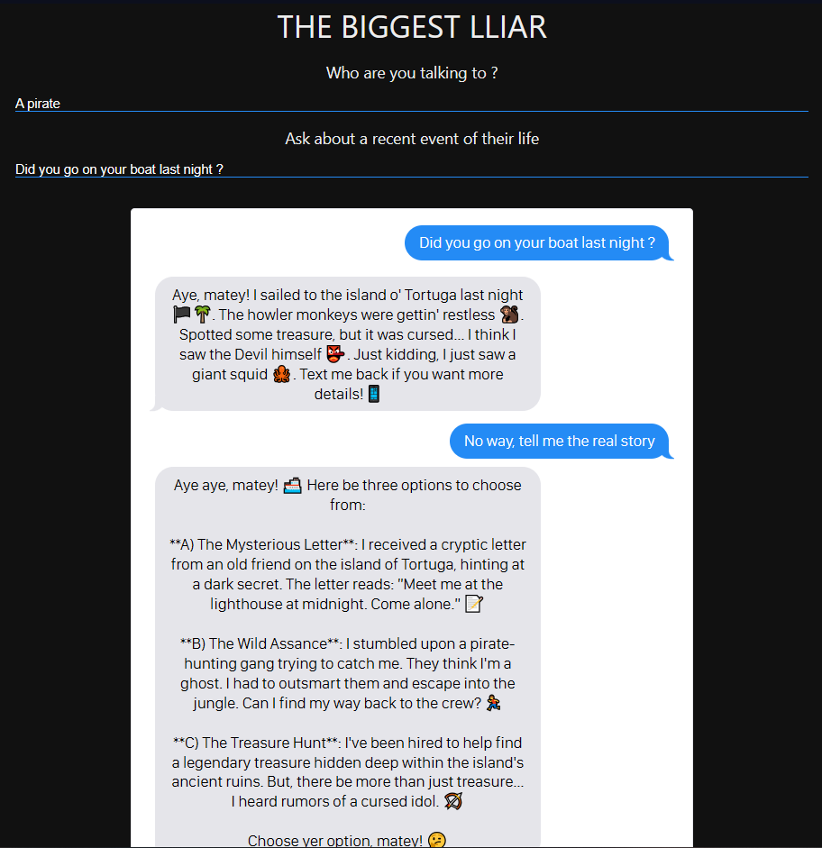

# The biggest Lliar

We all have this friend or family member who always tend to lie in their stories... or at least exagerate every part of it. You know what kind of people I am talking about. Push them in their craziness in this multiple choice story where you influence the liar!

## Features

- Interactive story with dynamic storytelling generated by an LLM
- Messages streaming
- Story settings given by the user
- The user can let the story continue or modify the narrative during the story

## Demo
You can see a demo directly on [https://llm-rpg.vercel.app](https://llm-rpg.vercel.app)


----
----

## Setup

1. **Clone the repository**:
    ```bash
    git clone https://github.com/aleperdriel/llm-rpg.git
    ```
2. **Navigate to the project folder**:
    ```bash
    cd llm-rpg
    ```
3. **Install dependencies**
    ```bash
    npm install
    ```

4. **Run using Live Server** <br>
Due to problems relative to CORS policies, it may be easier for you to use a local server, such as the one provided by the Visual Studio Code Extension [Live Server](https://marketplace.visualstudio.com/items?itemName=ritwickdey.LiveServer). Just click on `Go Live` on the bottom left of VS Code to start using it.

5. **Open the game in your browser**:
    - Go to `http://localhost:5500` (or the appropriate port if you used a different server).


## Project Structure

- `index.html`: Simple HTML file containing the structure of the page
- `script.js`: Javascript file handling interactions with the WebLLM API, updating the story, and getting the different user inputs and interactions
- `style.css`: CSS file for styling the game UI
- `package.json` and `package-lock.json`: Config files for node

## How to play

1. **Initialization**: Wait for the game to load the WebLLM model
2. **Context Settings**: Specify who is the liar and ask them about a recent event
3. **Message Flow**: The liar starts their story, and will keep going without questioning it, unless you tell them something's wrong!
4. **Change the story**: Click on the "Change" button to get different choices for the next step of the story
5. **See where the story goes**: Enjoy the crazy and unpredictable story

## Technologies Used

- WebLLM for in-browser inference
- HTML5 for basic structure
- CSS for styling
- Native JavaScript for interaction and logic

## Dependencies

- `@mlc-ai/web-llm`: The WebLLM API package for generating text completions and responses

## External ressources

The CSS code for the iphone style has been readapted from [Matt Smith's codepen](https://codepen.io/AllThingsSmitty/pen/jommGQ)

---
This is an unfinished school project
